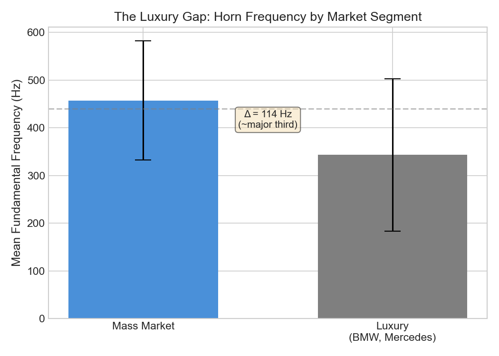
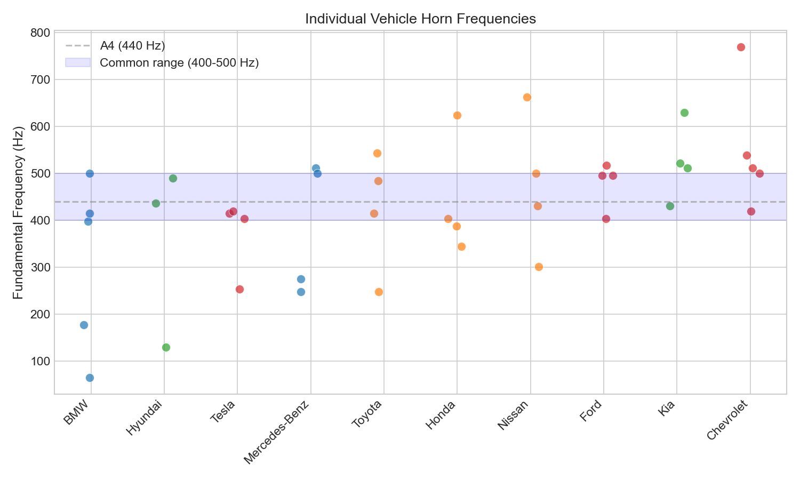
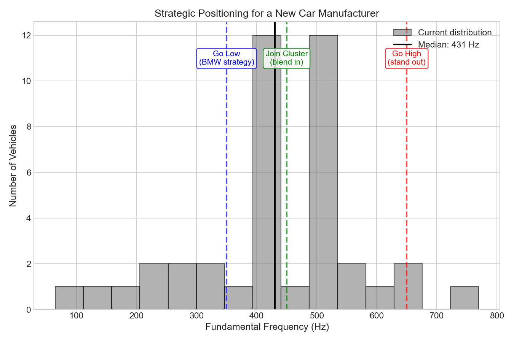

# The Optimal Pitch of the Car Honk

*Analyzing horn frequencies across 41 vehicles from 10 manufacturers*

Welcome back to Better Know a Dataset! Today we're exploring a dataset that, until last week, didn't exist: the fundamental frequencies of car horns by make and model.

I was standing at a Manhattan intersection when three cars honked simultaneously. One was a sharp, insistent beep. Another a lower, more authoritative blare. The third somewhere in between. Together they formed something like a chord, though not a pleasant one.

This got me wondering: who decides what pitch a car horn should be? Is there a standard? And if everyone's honking at once, shouldn't someone be coordinating?

## The Regulatory Landscape

You might assume car horn frequencies are tightly regulated. They're not.

In Europe, [UNECE Regulation 28](https://unece.org/fileadmin/DAM/trans/main/wp29/wp29regs/2018/R028am5e.pdf) specifies that horns must emit 105-118 decibels at two meters, with acoustic energy concentrated in the 1500-3550 Hz range. That upper bound matters: it's roughly the frequency of a human scream, which makes evolutionary sense. We're wired to notice sounds in that range.

In the US, the standard is remarkably lax. NHTSA doesn't even require cars to have horns. If one is installed, [FMVSS 571.101](https://www.law.cornell.edu/cfr/text/49/571.101) says only that it must be "operable by the driver." No frequency mandate whatsoever.

One convention that has persisted: bigger vehicles get lower horns. According to [Wikipedia's entry on vehicle horns](https://en.wikipedia.org/wiki/Vehicle_horn), "larger cars were always equipped with horns that gave an overall lower frequency honk, and small car horns were biased toward the higher frequencies. Hence the 'beep-beep' of Volkswagens and the French-horn type sounds from Cadillacs." Some countries even mandated this relationship, with the idea that a high-pitched horn indicates a small vehicle and a lower note signals a larger one. Ships follow the same convention: the RMS Queen Mary used 55 Hz horns, low enough to travel far without being painful to passengers, and modern maritime law requires ships over 660 feet to use frequencies between 70-200 Hz.

## The Psychoacoustics of Annoyance

Before diving into the data, some theory. Why do some horns sound "better" than others?

Most modern car horns hover around 440 Hz, which is A4, the note orchestras tune to. This isn't coincidence. It's a frequency humans perceive easily across ambient noise.

Premium vehicles typically use dual horns, each at a different pitch, often a minor third apart (say, 500 Hz and 420 Hz). Why a minor third? The physics of perception. When two pure tones are close in frequency, they create "beating," a wobbling interference pattern the ear perceives as roughness. Space them a minor third apart and the roughness disappears. The chord sounds smooth.

This turns out to be universal. A [2024 study in Nature Communications](https://www.nature.com/articles/s41467-024-45812-z) tested perception of musical intervals in communities including the Tsimane' of the Bolivian Amazon and villagers in Papua New Guinea with minimal exposure to Western harmony. Everyone found rough intervals unpleasant. The aversion to acoustic beating isn't cultural. It's wired in.

So car manufacturers have independently converged on similar solutions: frequencies around 400-500 Hz, often in consonant pairs, loud enough to cut through traffic but not so harsh as to be unbearable.

At least, that's the theory. I wanted to see what's actually happening on the road.

## Building the Dataset

I went looking for a comprehensive database of car horn frequencies by make and model. It doesn't exist. Car enthusiasts on forums share scattered measurements. Some manufacturers publish specs, but most don't. The regulation is minimal, so there's no compliance database.

So I built one.

**Methodology**: I searched YouTube for horn sound tests for 50 vehicles across 10 manufacturers (Toyota, Ford, Chevrolet, Honda, Hyundai, Nissan, Kia, BMW, Mercedes-Benz, and Tesla). For each video, I extracted the audio, isolated the horn segment, and ran a Fast Fourier Transform to identify the fundamental frequency. The analysis pipeline used Python's `librosa` library with a 4096-sample FFT window, identifying peaks in the 200-800 Hz range most likely to represent the horn's fundamental.

**Caveats**: YouTube audio compression isn't ideal for acoustic analysis. Some videos included ambient noise or reverb that could shift the detected fundamental. I excluded samples where the spectral peak was ambiguous. The final dataset includes 41 vehicles where I had high confidence in the frequency measurement.

The full dataset and analysis code are available on [GitHub](https://github.com/sangmino/car-honks).

## The Results

Here's what 41 car horns look like.

### By Country of Origin

German luxury brands (BMW, Mercedes-Benz) cluster around 343 Hz on average, while American manufacturers (Ford, Chevrolet, Tesla) run about 130 Hz higher at 472 Hz. In musical terms, that's roughly a perfect fourth—the interval you hear at the start of "Amazing Grace" or the Westminster Chimes.

Japanese manufacturers land in the middle at 445 Hz, remarkably close to concert pitch (A4 = 440 Hz). Korean manufacturers (Hyundai, Kia) cluster nearby at 450 Hz.

### By Manufacturer

BMW sits at the bottom with a mean of 311 Hz. Chevrolet at the top with 548 Hz. Honda lands almost exactly on concert pitch at 440 Hz, which feels appropriate for a company known for engineering precision.

The spread within manufacturers is interesting too. BMW's 182 Hz standard deviation suggests they're tailoring horn pitch to vehicle class (their X3 and X5 SUVs have notably lower frequencies than their sedans). Ford's tight 50 Hz spread implies a more standardized approach across their lineup.

### The Luxury Gap

Perhaps the most striking finding: luxury vehicles (BMW, Mercedes, plus luxury trims from other manufacturers) average 343 Hz. Mass market vehicles average 457 Hz. That 114 Hz gap is roughly a major third—the same interval manufacturers use in dual-horn setups.

The BMW announces itself with a baritone authority; the Honda Civic chirps from the tenor section. This pattern holds even within manufacturer: the BMW X5 (luxury SUV) honks lower than the Honda Civic (mass market compact), confirming that the "big car, low pitch" convention documented in the Wikipedia article extends to modern vehicles.

### Individual Vehicle Distribution

Most vehicles cluster in the 400-500 Hz range, but the outliers are dramatic. The Corvette screams at 770 Hz (roughly G5)—if a BMW X3 is a cello, the Corvette is a piccolo.

## Dual Horn Analysis

Four vehicles in my sample had detectable second horn frequencies, all using consonant intervals as the psychoacoustics would predict:

- **Chevrolet Tahoe**: 538 Hz + 657 Hz (ratio 1.22, minor third)
- **Kia Sorento**: 522 Hz + 678 Hz (ratio 1.30, major third)
- **Honda HR-V**: 624 Hz + 479 Hz (ratio 0.77, perfect fourth)
- **Nissan Pathfinder**: 431 Hz + 323 Hz (ratio 0.75, perfect fourth)

No manufacturer in my sample paired horns a semitone apart, which would create maximum beating and dissonance. They're avoiding the acoustic equivalent of nails on a chalkboard.

## The Economics of Honking

Here's where this gets interesting from a social science perspective.

Traffic noise isn't just annoying. It's expensive. A [recent NBER paper](https://www.nber.org/papers/w34298) by Currie, Davis, Greenstone, and Walker puts the aggregate cost of traffic noise in the US at $110 billion annually. Property values near highways decline 0.4-1.1% per decibel. The burden falls disproportionately on low-income and minority households, making traffic noise a **regressive externality**—a cost imposed on others that hits poorer people harder.

The authors calculate that internalizing these costs would require a **Pigovian tax** (a tax designed to correct for negative externalities) of $974 per vehicle. And they find that the shift to electric vehicles, which are quieter, could yield $77 billion in noise reduction benefits alone—about a fifth of EVs' total external benefit.

Horns are a small piece of this noise picture, but they're a pointed one. A horn is *deliberately* annoying. That's the point.

## The Social Planner's Problem

Economists have a useful thought experiment called the **social planner**. Imagine a benevolent, all-knowing decision-maker whose only goal is to maximize total welfare for society. No politics, no lobbying, no corporate interests. Just: what arrangement would make everyone best off?

The social planner is fictional, of course. But the concept helps us spot when individual decisions add up to collective problems.

Here's the puzzle with car horns. Each manufacturer chooses a horn pitch to maximize the probability that their customers' honks get noticed, subject to not being so grating that buyers complain. Toyota optimizes for Toyota. Honda optimizes for Honda. Everyone's doing what's best for themselves.

But when multiple cars honk at once, all that individual optimization creates a collective mess. The resulting cacophony is worse than the sum of its parts. Two horns a semitone apart create beating. Three random pitches create chaos. What's good for each company isn't good for everyone standing at the intersection.

Economists call this a **coordination failure**. Each player is acting rationally, but the outcome is worse than if they'd coordinated. It's the same logic behind traffic jams (everyone takes the "fastest" route, which makes it slow), overfishing (each boat maximizes its catch, depleting the stock), and, apparently, Manhattan soundscapes.

So what would a social planner do with car horns? She might assign frequencies to manufacturers to ensure harmony. Toyota gets 440 Hz. Honda gets 523 Hz (a major third up). BMW gets 659 Hz (a perfect fifth). Now when all three honk at once, they form a major chord. The intersection becomes a symphony.

This isn't as crazy as it sounds. We already do this for radio frequencies: the FCC assigns spectrum so stations don't interfere with each other. Musicians worldwide agreed that A=440 Hz so orchestras can tune together. Why not horns?

## If You're Starting a Car Company

Say you're launching a new electric vehicle brand and need to choose a horn frequency. What should you pick?

Based on the data, you have three main strategies:

**1. Join the cluster (400-500 Hz)**

Most manufacturers land here. Your horn blends with traffic—safe, unremarkable, unlikely to annoy customers or stand out. This is the Toyota/Honda approach: reliable, inoffensive, forgettable.

**2. Go low (300-350 Hz)**

This is the BMW/Mercedes strategy. A lower pitch sounds more authoritative and signals "large vehicle approaching" even if you're selling a compact. It also differentiates your brand acoustically. The downside: lower frequencies require larger horn assemblies, which cost more and take up space.

**3. Go high (600+ Hz)**

The Corvette approach. Maximum attention-grabbing, maximum annoyance. Your customers will definitely be heard. Everyone else will hate them. This works for sports cars where aggression is part of the brand identity, but probably not for a family SUV.

**4. Coordinate for consonance (the road not taken)**

If you knew every other manufacturer's frequency, you could pick a pitch that forms pleasant intervals with the most common horns. At 430 Hz and 500 Hz (the two densest clusters), adding a horn at 344 Hz would create a major triad with any car in those ranges. Adding one at 645 Hz would create a major seventh chord.

Nobody does option 4. Each manufacturer optimizes alone, and the intersection symphony remains unwritten.

## The Counterargument

The counterargument is that chaos might be the point. Random pitches are more attention-grabbing than harmonious ones. If the goal is to alert pedestrians to danger, maybe we want horns that *don't* blend into a pleasant hum. The semitone clash that sounds terrible at the intersection might be saving lives.

There's also the signaling function to consider. If luxury cars use distinctively low pitches, and pedestrians learn to associate low honks with expensive vehicles, that's information. A coordinated system might preserve safety while destroying the signal.

## Extensions

This dataset is a starting point. Here's what I'd like to see:

1. **Correlate with MSRP**: Does horn frequency predict vehicle price? My luxury/mass-market split suggests yes, but a proper regression with price data would nail it down.

2. **Record actual intersections**: My data comes from isolated horn tests. What does the frequency distribution look like at a real Manhattan intersection? What chords emerge naturally?

3. **Test pedestrian response**: Do people actually react differently to 350 Hz versus 500 Hz horns? Is the "low pitch = big vehicle" signal actually received?

4. **International comparison**: Are horn frequencies different in Seoul versus Stuttgart versus Detroit? Does local taste influence design?

The data now exists. The coordination problem remains unsolved. And somewhere in Manhattan, three cars are honking a diminished chord, and nobody's enjoying it.

---

*The dataset and analysis code are available on [GitHub](https://github.com/sangmino/car-honks). If you extend this analysis, I'd love to hear about it.*
