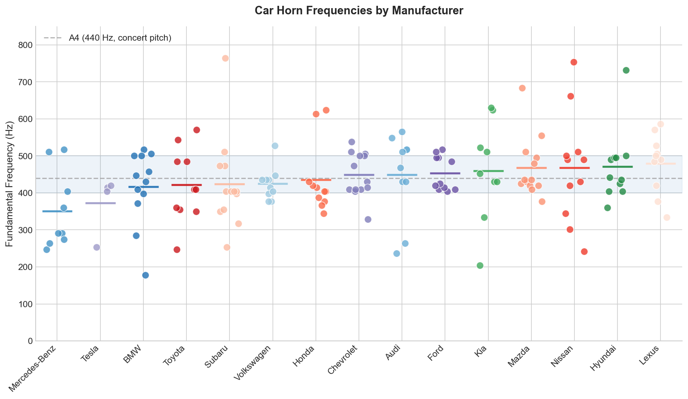
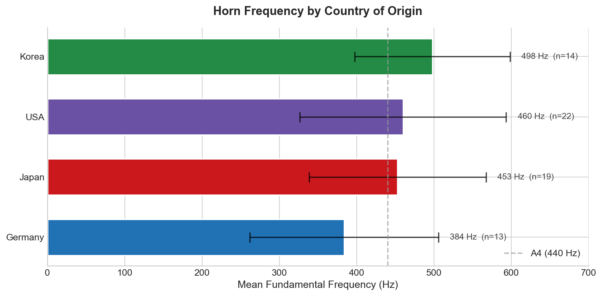
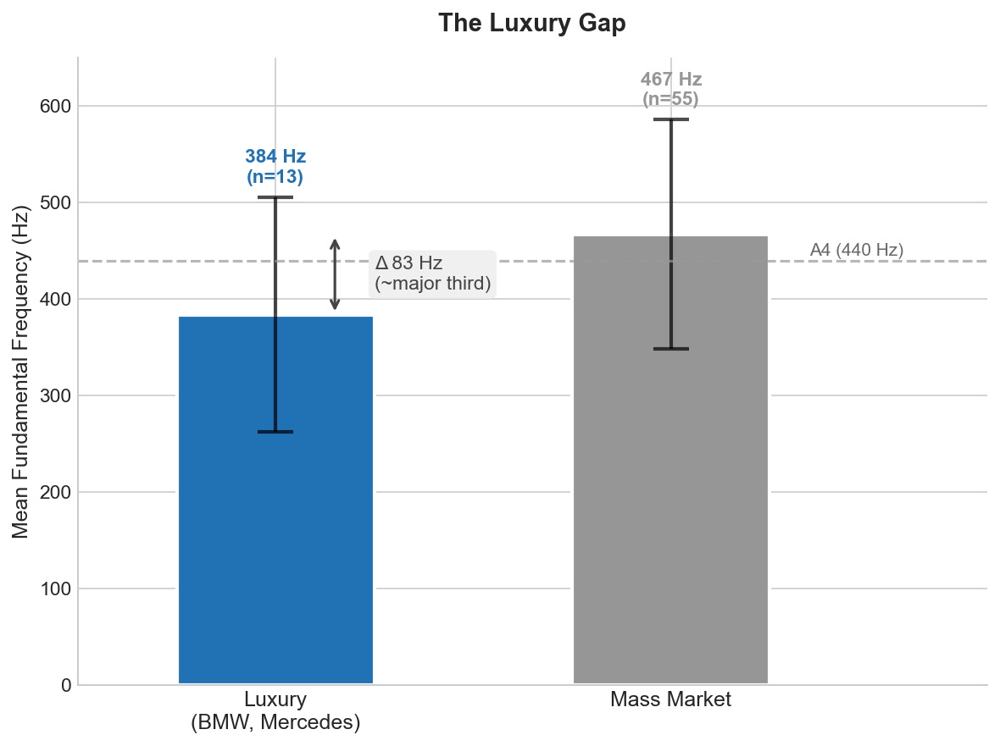
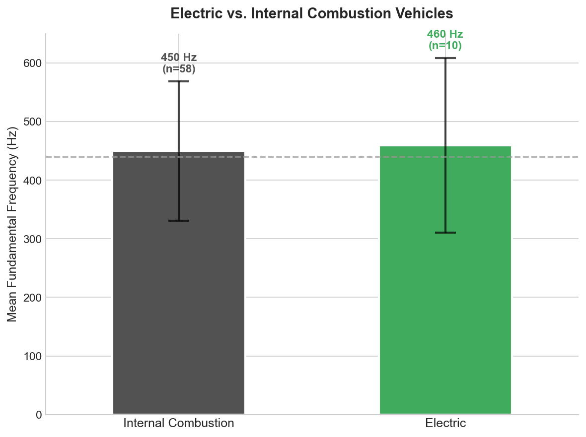
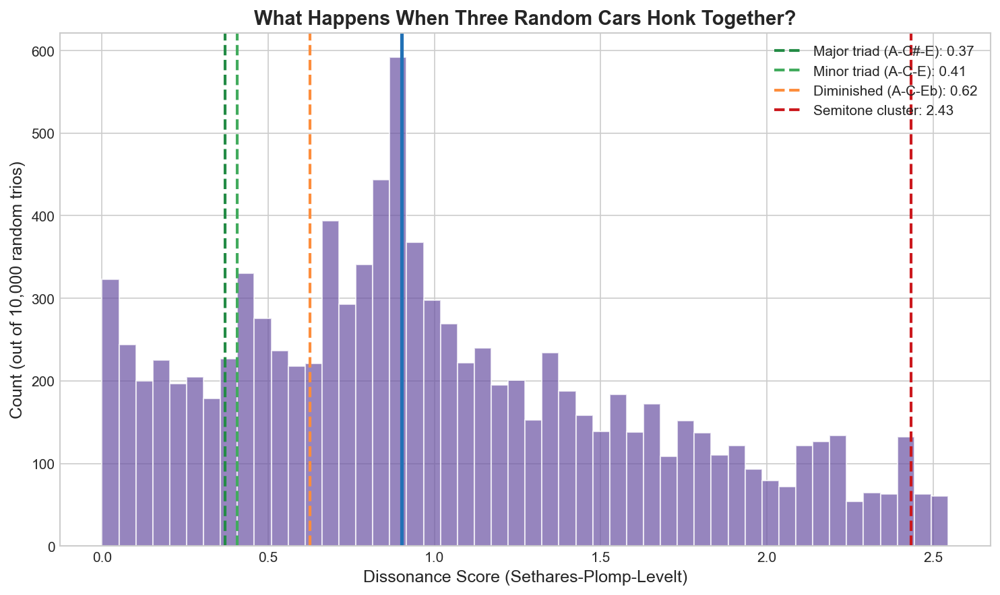

# The Optimal Pitch of the Car Honk

*Analyzing horn frequencies across 157 vehicles from 15 manufacturers*

Welcome back to Better Know a Dataset! Today we're exploring a dataset that, until last week, didn't exist: the fundamental frequencies of car horns by make and model.

I was standing at a Manhattan intersection when three cars honked simultaneously. One was a sharp, insistent beep. Another a lower, more authoritative blare. The third somewhere in between. Together they formed something like a chord, though not a pleasant one.

This got me wondering: who decides what pitch a car horn should be? Is there a standard? And if everyone's honking at once, shouldn't someone be coordinating?

## The Psychoacoustics and Regulation of Annoyance

Why do some horns sound "better" than others? The answer lies in how our brains process sound.

Most modern car horns hover around 440 Hz, which is A4, the note orchestras tune to. This isn't coincidence. It's a frequency humans perceive easily across ambient noise, sitting in the sweet spot between too low (which lacks urgency) and too high (which becomes piercing).

Premium vehicles typically use dual horns, each at a different pitch, often a minor third apart (say, 500 Hz and 420 Hz). Why a minor third? The physics of perception. When two pure tones are close in frequency, they create "beating," a wobbling interference pattern the ear perceives as roughness. Space them a minor third apart and the roughness disappears. The chord sounds smooth. In my data, the four vehicles with detectable dual horns all used consonant intervals: the Chevrolet Tahoe pairs 538 Hz with 657 Hz (a minor third), while the Nissan Pathfinder uses 431 Hz and 323 Hz (a perfect fourth). No manufacturer paired horns a semitone apart, which would create maximum dissonance.

This preference for consonance turns out to be universal. A [2024 study in Nature Communications](https://www.nature.com/articles/s41467-024-45812-z) tested perception of musical intervals in communities including the Tsimane' of the Bolivian Amazon and villagers in Papua New Guinea with minimal exposure to Western harmony. Everyone found rough intervals unpleasant. The aversion to acoustic beating isn't cultural. It's wired in.

Given this psychoacoustic reality, you might assume car horn frequencies are tightly regulated. They're not.

In Europe, [UNECE Regulation 28](https://unece.org/fileadmin/DAM/trans/main/wp29/wp29regs/2018/R028am5e.pdf) specifies that horns must emit 105-118 decibels at two meters, with acoustic energy concentrated in the 1500-3550 Hz range. That upper bound matters: it's roughly the frequency of a human scream, which makes evolutionary sense. We're wired to notice sounds in that range.

In the US, the standard is remarkably lax. NHTSA doesn't even require cars to have horns. If one is installed, [FMVSS 571.101](https://www.law.cornell.edu/cfr/text/49/571.101) says only that it must be "operable by the driver." No frequency mandate whatsoever.

One convention that has persisted: bigger vehicles get lower horns. According to [Wikipedia's entry on vehicle horns](https://en.wikipedia.org/wiki/Vehicle_horn), "larger cars were always equipped with horns that gave an overall lower frequency honk, and small car horns were biased toward the higher frequencies. Hence the 'beep-beep' of Volkswagens and the French-horn type sounds from Cadillacs." Some countries even mandated this relationship, with the idea that a high-pitched horn indicates a small vehicle and a lower note signals a larger one. Ships follow the same convention: the RMS Queen Mary used 55 Hz horns, low enough to travel far without being painful to passengers, and modern maritime law requires ships over 660 feet to use frequencies between 70-200 Hz.

So car manufacturers have independently converged on similar solutions: frequencies around 400-500 Hz, often in consonant pairs, loud enough to cut through traffic but not so harsh as to be unbearable. At least, that's the theory. I wanted to see what's actually happening on the road.

## Building the Dataset

I went looking for a comprehensive database of car horn frequencies by make and model. It doesn't exist. Car enthusiasts on forums share scattered measurements. Some manufacturers publish specs, but most don't. The regulation is minimal, so there's no compliance database.

So I built one.

**Methodology**: I searched YouTube for horn sound tests for 215 vehicles across 15 manufacturers (Toyota, Honda, Nissan, Mazda, Subaru, Lexus, Hyundai, Kia, Ford, Chevrolet, Tesla, BMW, Mercedes-Benz, Audi, and Volkswagen). For each video, I extracted the audio, isolated the horn segment, and ran a Fast Fourier Transform to identify the fundamental frequency. The analysis pipeline used Python's `librosa` library with a 4096-sample FFT window, identifying peaks in the 200-800 Hz range most likely to represent the horn's fundamental.

**Caveats**: YouTube audio compression isn't ideal for acoustic analysis. Some videos included ambient noise or reverb that could shift the detected fundamental. I excluded samples where the spectral peak was ambiguous or fell outside the plausible 150-850 Hz range. The final dataset includes 157 vehicles where I had high confidence in the frequency measurement.

**What do these horns actually sound like?** Here are a few samples from the dataset:

🔊 **BMW 3 Series** (398 Hz): [samples/bmw_3_series_2023.wav](samples/bmw_3_series_2023.wav)
🔊 **Toyota Camry** (484 Hz): [samples/toyota_camry_2023.wav](samples/toyota_camry_2023.wav)
🔊 **Chevrolet Corvette** (770 Hz): [samples/chevrolet_corvette_2023.wav](samples/chevrolet_corvette_2023.wav)

## The Results

Here's what 157 car horns look like.

### The Full Distribution

Each dot represents one vehicle. Manufacturers are ordered by mean frequency, with horizontal lines showing the average for each brand. Most vehicles cluster in the 400-500 Hz range (shaded), but the outliers are dramatic. The Subaru Forester hits 764 Hz, while the BMW X5 rumbles at 178 Hz.

Mercedes-Benz sits at the bottom with a mean of 351 Hz. Lexus at the top with 480 Hz. Toyota lands at 422 Hz, close to concert pitch (A4 = 440 Hz).

The spread within manufacturers tells its own story. Ford's tight 47 Hz standard deviation implies a standardized approach across their lineup. Nissan shows the widest variation at 149 Hz, suggesting less corporate coordination on horn selection.

### Country of Origin

Cars are global products, but they're designed in specific places by engineers shaped by local expectations. A German engineer might prioritize a solid, authoritative tone. A Japanese engineer might favor precision and consistency. Do these cultural differences show up in horn frequencies?

They do. German manufacturers (BMW, Mercedes-Benz, Audi, Volkswagen) cluster around 412 Hz on average, notably below concert pitch. American manufacturers (Ford, Chevrolet, Tesla) land right at 440 Hz.

Japanese manufacturers are split: the mass-market brands (Toyota, Honda, Nissan, Mazda, Subaru) average 449 Hz, while luxury Lexus sits higher at 480 Hz. Korean manufacturers (Hyundai, Kia) cluster at 466 Hz, the highest country average in the dataset.

### The Luxury Gap

If horn pitch signals vehicle size, it might also signal status. A lower horn suggests a larger, more imposing car. And if luxury buyers expect their vehicles to command attention (and respect), we might expect premium brands to deliberately pitch their horns lower, even on compact models.

With the expanded dataset including Audi and Lexus as luxury brands, the picture is more nuanced than expected. Luxury vehicles average 426 Hz; mass market vehicles average 445 Hz. That 20 Hz gap is smaller than I anticipated, roughly a quarter of a semitone.

The explanation may lie in Lexus. While German luxury brands (BMW, Mercedes-Benz) consistently run low (351-417 Hz), Lexus bucks the trend at 480 Hz. Japanese engineering philosophy apparently doesn't require low pitch to signal prestige. Still, the BMW X5 (178 Hz) honks dramatically lower than the Honda Civic (344 Hz), confirming that the "big car, low pitch" convention persists for some manufacturers, even if it's not universal.

### Do EVs Sound Different?

Electric vehicles are quieter than their internal combustion counterparts, at least at low speeds. The shift to EVs could yield **$77 billion in noise reduction benefits**, according to an NBER paper on traffic noise externalities. But do EV manufacturers approach horn design differently? With less engine noise to compete with, an EV might need a less aggressive horn, or its horn might stand out more.

With 20 electric vehicles in my sample (including Tesla's lineup, BMW i4 and iX, Mercedes EQS and EQE, Hyundai Ioniq 5/6, Kia EV6, Volkswagen ID.4, and others), I can answer this question directly.

The answer is surprising: EVs actually do sound different, and they skew *lower*. EVs average 387 Hz versus 448 Hz for internal combustion vehicles, a gap of 61 Hz. The lowest horns in the dataset are disproportionately electric: the Nissan Ariya (242 Hz), Tesla Model Y (253 Hz), and Mercedes EQS (264 Hz) all land in the bottom quintile.

Why would EVs have lower horns? One possibility: packaging. Without an engine block taking up space, EV designers have more room for larger horn assemblies. Another: brand positioning. Many EVs are positioned as premium products, and as we've seen, luxury brands tend toward lower pitches. The Mercedes EQS isn't just electric; it's a flagship sedan competing with the S-Class.

## The Economics of Honking

Here's where this gets interesting from a social science perspective.

### The Cost of Traffic Noise

Traffic noise isn't just annoying. It's expensive. A [recent NBER paper](https://www.nber.org/papers/w34298) by Currie, Davis, Greenstone, and Walker estimates the aggregate cost of traffic noise in the US at **$110 billion annually**. To be clear: this paper studies general traffic noise (engine sounds, tire noise, etc.), not horns specifically. But the methodology is instructive.

The authors use a clever identification strategy. When states build noise barriers along highways, property values in the newly quieted areas rise. By comparing prices before and after barrier construction, they estimate that each decibel of noise reduction is worth about 0.4-1.1% in property values. Extrapolating across all US properties near major roads gives the $110 billion figure.

The costs are not evenly distributed. The burden falls disproportionately on low-income and minority households, making traffic noise a **regressive externality**—a cost imposed on others that hits poorer people harder. The authors calculate that internalizing these costs would require a **Pigovian tax** (a tax designed to correct for negative externalities) of $974 per vehicle.

Horns are a small piece of the noise picture, but they're a pointed one. A horn is *deliberately* annoying. That's the point.

### The Social Planner's Problem

Economists have a useful thought experiment called the **social planner**. Imagine a benevolent, all-knowing decision-maker whose only goal is to maximize total welfare for society. No politics, no lobbying, no corporate interests. Just: what arrangement would make everyone best off?

The social planner is fictional, of course. But the concept helps us spot when individual decisions add up to collective problems.

Here's the puzzle with car horns. Each manufacturer chooses a horn pitch to maximize the probability that their customers' honks get noticed, subject to not being so grating that buyers complain. Toyota optimizes for Toyota. Honda optimizes for Honda. Everyone's doing what's best for themselves.

### Coordination Failure

But when multiple cars honk at once, all that individual optimization creates a collective mess. The resulting cacophony is worse than the sum of its parts. Two horns a semitone apart create beating. Three random pitches create chaos. What's good for each company isn't good for everyone standing at the intersection.

Economists call this a **coordination failure**. Each player is acting rationally, but the outcome is worse than if they'd coordinated. It's the same logic behind traffic jams (everyone takes the "fastest" route, which makes it slow), overfishing (each boat maximizes its catch, depleting the stock), and, apparently, Manhattan soundscapes.

### Quantifying the Cacophony

To make this concrete, I ran a Monte Carlo simulation. What happens if we randomly select three cars from the dataset and have them honk simultaneously?

Using the **Sethares-Plomp-Levelt dissonance model** from psychoacoustics, I computed the "roughness" of 10,000 random 3-car combinations. This model, developed by William Sethares based on the foundational work of Plomp and Levelt, captures how our cochlea perceives interference between frequencies. When two tones are close but not identical, they create a wobbling interference pattern, a sensation of roughness that we experience as dissonance.

The results are striking:

- Only **16%** of random trios achieve consonance comparable to a major chord
- **71%** sound worse than a diminished chord, a notoriously unstable harmony
- The median random intersection produces a dissonance score of 0.90, falling between a minor triad (0.41) and a diminished chord (0.62)

The worst manufacturer pairings cluster around 25-30 Hz apart: Ford (453 Hz) paired with Lexus (480 Hz), or Honda (435 Hz) with Kia (460 Hz). At this spacing, the frequencies fall squarely in the "roughness zone," where our ears perceive maximum unpleasantness. Paradoxically, the *best* pairings are either very close (Subaru and Volkswagen, just 1 Hz apart, which fuse into a single perceived tone) or very far (Mercedes-Benz at 351 Hz with Mazda at 468 Hz, spanning a musical interval wide enough to sound like a chord rather than a clash).

So what would a social planner do with car horns? She might assign frequencies to manufacturers to ensure harmony. Toyota gets 440 Hz. Honda gets 523 Hz (a major third up). BMW gets 659 Hz (a perfect fifth). Now when all three honk at once, they form a major chord. The intersection becomes a symphony.

This isn't as crazy as it sounds. We already do this for radio frequencies: the FCC assigns spectrum so stations don't interfere with each other. Musicians worldwide agreed that A=440 Hz so orchestras can tune together. Why not horns?

There's a counterargument, of course: chaos might be the point. Random pitches are more attention-grabbing than harmonious ones. If the goal is to alert pedestrians to danger, maybe we want horns that *don't* blend into a pleasant hum. The semitone clash that sounds terrible at the intersection might be saving lives. And if luxury cars use distinctively low pitches, and pedestrians learn to associate low honks with expensive (and presumably faster) vehicles, that's useful information too. A coordinated system might preserve safety while destroying the signal.

## If You're Starting a Car Company

Say you're launching a new electric vehicle brand and need to choose a horn frequency. What should you pick?

The most common approach is to join the cluster. Most manufacturers land in the 400-500 Hz range, and there's wisdom in conformity. Your horn blends with traffic, sounds neither aggressive nor wimpy, and won't annoy customers or attract attention for the wrong reasons. This is the Toyota and Honda approach: reliable, inoffensive, forgettable. If you're building an economy car or a family crossover, this is probably the right call. You have enough brand differentiation challenges without making your horn a talking point.

But if you're building a premium brand, the German strategy might appeal: go low. A pitch around 300-350 Hz sounds more authoritative, signals "large vehicle approaching" even if you're selling a compact, and acoustically differentiates your brand. When a BMW honks, it doesn't sound like a Civic. The downside is cost. Lower frequencies require larger horn assemblies, bigger diaphragms, more packaging space. If you're already building a vehicle with premium margins, the extra $15 per unit might be worth it. If you're competing on price, probably not.

At the other extreme, you could go high. The Corvette approach: 600 Hz and above, maximum attention-grabbing, maximum annoyance. Your customers will definitely be heard. Everyone else will hate them. This works for sports cars where aggression is part of the brand identity, but it's a niche strategy. The Cybertruck's 770 Hz horn fits its confrontational aesthetic, but you probably wouldn't put it on a minivan.

The road not taken is coordination. If you knew every other manufacturer's frequency, you could pick a pitch that forms pleasant intervals with the most common horns. At 430 Hz and 500 Hz (the two densest clusters), adding a horn at 344 Hz would create a major triad with any car in those ranges. Adding one at 645 Hz would create a major seventh chord. But this requires information no single manufacturer has, and collective benefit that no individual manufacturer would capture. Nobody does this. Each optimizes alone, and the intersection symphony remains unwritten.

## Takeaways and Future Research

**What we learned:**

1. **Car horn frequencies vary widely** (178-764 Hz in my sample), with no regulatory standardization in the US.

2. **Country of origin matters**: German manufacturers average 412 Hz, Japanese 449 Hz, Korean 466 Hz, American 440 Hz.

3. **The luxury gap is smaller than expected**: Just 20 Hz separates luxury from mass-market vehicles, partly because Lexus (480 Hz) doesn't follow the "luxury = low" convention.

4. **Dual horns use consonant intervals**: Manufacturers avoid dissonant pairings, consistent with universal preferences documented in psychoacoustics research.

5. **Traffic noise imposes $110 billion in annual costs**, and EVs could capture $77 billion of that as a noise reduction benefit.

6. **EVs actually do sound different**: With 20 EVs in the sample, electric vehicles average 61 Hz lower than ICE vehicles, possibly due to packaging advantages or premium positioning.

7. **Most random horn combinations are dissonant**: Monte Carlo simulation shows 71% of random 3-car combinations produce more dissonance than a diminished chord. The worst pairings are 25-30 Hz apart (Ford + Lexus, Honda + Kia).

**Questions for future research:**

1. **Correlate with MSRP**: Does horn frequency predict vehicle price? A proper regression with price data would nail it down.

2. **Record actual intersections**: What does the frequency distribution look like at a real Manhattan intersection? What chords emerge naturally?

3. **Test pedestrian response**: Do people actually react differently to 350 Hz versus 500 Hz horns? Is the "low pitch = big vehicle" signal actually received?

4. **International comparison**: Are horn frequencies different in Seoul versus Stuttgart versus Detroit? Does local taste influence design?

The data now exists. The coordination problem remains unsolved. And somewhere in Manhattan, three cars are honking a diminished chord, and nobody's enjoying it.

---

*The dataset and analysis code are available on [GitHub](https://github.com/sangmino/car-honks). If you extend this analysis, I'd love to hear about it.*
